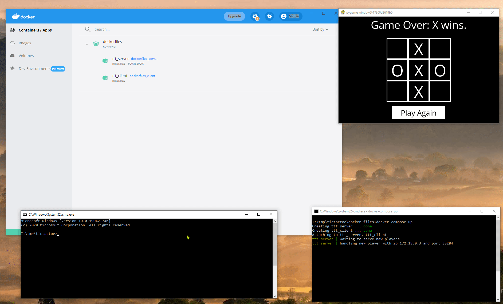

# Distributed AI Tic-tac-toe

This is a tic-tac-toe game in a distributed manner in which players can connect to a broker server as their opponent, and enjoy their game. The broker server is able to play concurrently, using threads, with all the connected players. Socket programming is used for communication between each player and the broker server. The following shows the architecture of the application:

__Docker__ is used as the virtualisation technology needed for the distributed nature of the application.

# The Code in Action

* The following shows the running of the whole application for one gamer and the responsible server:

---

* The following shows the addition of another player, and the capability of the server handling them simultaneously:

---

* The following shows that we could have as many player as we desire, and the server is able to handle them all:

